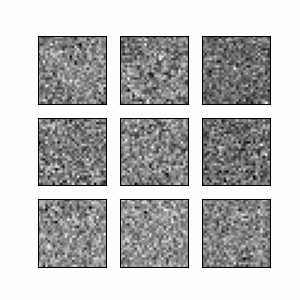

# Generating MNIST digits with diffusion models

Simple implementations of the main diffusion models techniques to generate MNIST digits with context embeddings. In the notebooks folder you'll find notebooks to train the models with a brief explanation about the theory of DDPM and DDIM (DDIM not ready yet).

There's also a Streamlit application to easily visualize the results.

## Results 

### DDPM on MNIST:

### DDIM on MNIST:

### Stable Diffusion on CIFAR-10