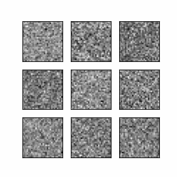

# Experiments with Diffusion Models

Clean implementations of the main diffusion models techniques to generate MNIST digits with context embeddings. The codes used here are modifications of the notebooks provided in DeepLearning.ai's excellent course "How Diffusion Models Work".

## Results 

### DDPM on MNIST:

### DDIM on MNIST:

### Stable Diffusion on CIFAR-10